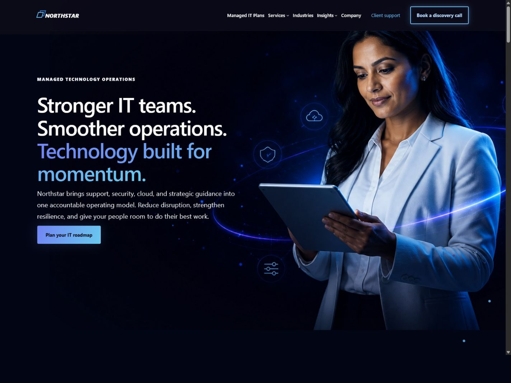

# MSP Nexus

MSP Nexus is an original, commercial-grade WordPress product suite for managed service providers. It consists of a block theme, a companion functionality and visual-design plugin, a child-theme starter, and an independent licensing and update service.



This repository is a clean-room implementation. Reference products were studied only to understand capability categories, packaging conventions, operational safeguards, and commercial expectations. No proprietary source, visual design, copy, trademarks, or update endpoints are reused. Distributed WordPress code is GPL-2.0-or-later; commercial entitlement controls apply only to separately provided services and delivery.

## Packages

- `packages/msp-nexus` — full-site-editing theme.
- `packages/msp-nexus-core` — Nexus Studio, content model, conditional layouts, dynamic blocks, onboarding, diagnostics, integrations, and license client.
- `packages/msp-nexus-child` — customization-safe child theme starter.
- `services/licensing-service` — entitlement, activation, signed-update, package-delivery, and portal service.
- `demo` — original demo data and deterministic import manifests.
- `docs` — architecture, security, operations, editing, API, and traceability documentation.
- `scripts` — validation and packaging automation.

## Compatibility target

- Tested target: WordPress 7.0.3.
- Minimum WordPress: 6.7.
- Minimum PHP: 7.4.33.
- Node.js: 22 or newer for development tooling.

The theme and plugin use WordPress-native block APIs, semantic HTML, progressive enhancement, and server-side registration from `block.json`.

## Development

```powershell
npm install
npm run check
npm run package
npm run qa:php74
```

The official WordPress Playground blueprints under `artifacts/` verify packaged single-site and multisite installs on PHP 7.4.33 without requiring native PHP or Docker. The licensing service test suite covers persistence-domain and HTTP contracts. See `docs/DEVELOPMENT.md` and `docs/TESTING_AND_VALIDATION.md`.

## Product status

Version 0.4.0 delivers the expanded Nexus Studio authoring workspace, a 200+ composition inserter, an 800-configuration MSP starter catalog, responsive geometry and conditions, visual dynamic data/loops, advanced headers/menus/popups, WooCommerce template tooling, Elementor widgets, consent controls, white labeling, portability, and performance tooling. The architecture remains a clean-room, WordPress-native replacement rather than a source or UI clone. See `docs/REQUIREMENTS_TRACEABILITY.md` for requirement-level evidence and intentional safety boundaries.
